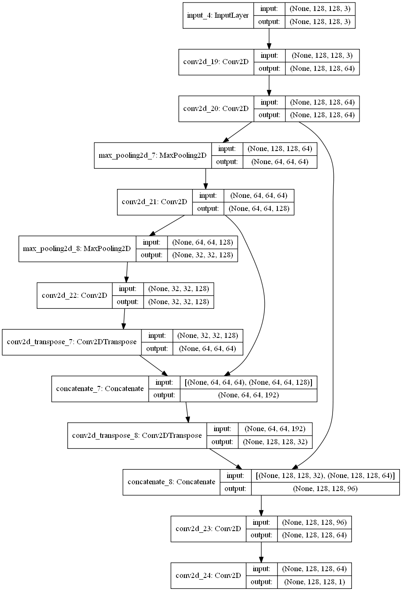
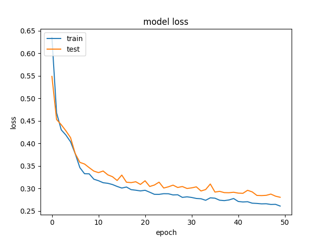
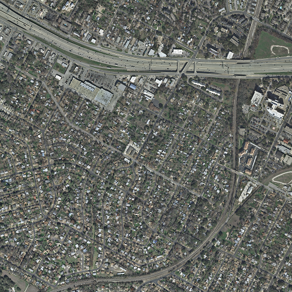

# Semantic segmentation on buildings

### Project 

This project is based on the [INRIA Aerial Image Labeling Dataset](https://project.inria.fr/aerialimagelabeling/).
The aim is to build an algorithm based on neural network performing semantic segmentation on buildings.

The open source library [buzzard](https://github.com/airware/buzzard/) developped by Airware has been used to manage georeferenced data. 
The results are saved and store at the geoJSON format.

### Main ideas

The solution implemented is inspired by the [TernausNet](https://arxiv.org/abs/1801.05746) based on an autoencoder that reuses the features learned during the encoding part for the decoding part.
The used architecture was :

All the convolutional layers except the last one (sigmoid) are using ReLu activation function. The size of the filters are (3,3) and with use 2 strides for the deconvolution.

The network is trained on `n_samples` croped images of size (`image_size`,`image_size`) resampled with a given `downsampling_factor`.

The treatment for the whole image is proceeed by tiling the whole image into several tiles of size (`image_size`,`image_size`) and then untiling them to reconstruct the entire binary image.
The results are polygons saved at the geoJSON format (same name of the original image)

### Resuts

Due to limited computational performances, we only chose a dataset of 180x`n_samples` images with `downsampling_factor=3`. The batch number is fixed at 40 and the number of epochs at 50.
Here is the history of the loss function (binary crossentropy):

The results are shown for the first train file of the dataset:

The original image:

The reference binaryzed image:

The predicted binaryzed image:
[predicted bin](Results/predicted_segmentation.png)

To eveluate the accuracy of the model, with use the intersection over union metric.
The results for the different towns displayed in the following table:

| Town    | Mean IoU (%) | Var IoU (%) | Max IoU (%) | Min IoU (%) |
|---------|--------------|-------------|-------------|-------------|
| Austin  | 38.61        | 20.24       | 47.00       | 29.25       |
| Chicago | 39.20        | 25.66       | 48.63       | 20.52       |
| Kitsap  | 16.41        | 175.06      | 41.10       | 1.71        |
| Tyrol-w | 44.56        | 59.89       | 56.76       | 28.31       |
| Vienna  | 49.85        | 97.60       | 67.03       | 26.27       |

